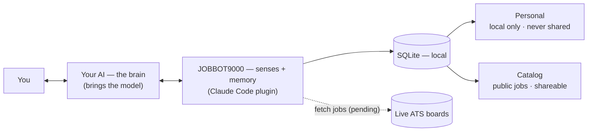
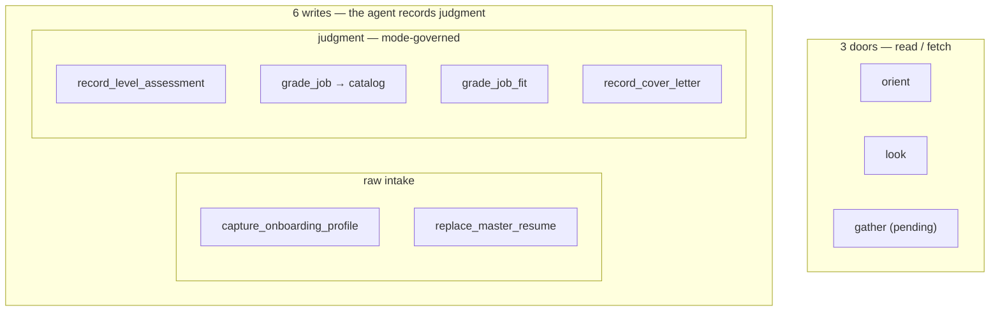
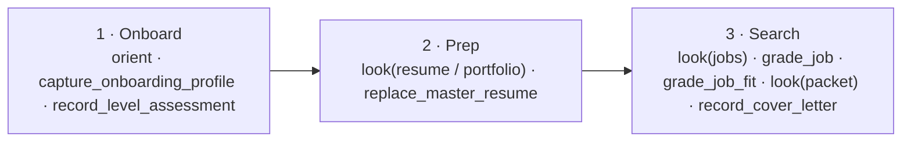

# jobbot9000

A local, market-aware job-search and portfolio-readiness coach for your AI agent — packaged as a **Claude Code plugin**. One install bundles an MCP server (which gathers real job-market data and coaches against it) and the skills that drive it. Your agent is the brain; this is its senses and memory. Nothing is hosted, and no keys leave your machine.



## How it works

- **The agent is the brain; the server is senses + memory.** It reads the live job market straight from company ATS boards, holds the journey across sessions in an embedded SQLite database, and coaches honestly against real demand. It does not think — your agent does.
- **You bring the model; the server holds none** — no keys, tokens, or login. Single-tenant, your own local instance. That is why it's an MCP server, not a hosted app.
- **Local and passive.** It offers tools and keeps state; it runs nothing on its own schedule. The user, through their agent, decides when to gather data — and **applies to jobs themselves.** It never sends anything.

Two rules hold everywhere:

- **The agent never writes the database.** Only `src/db.ts` writes; tools call its accessors. The agent supplies content through a tool, never a raw write.
- **Judgment** (a job's grade, the user's level/fit, a cover letter) enters only through a named **structured-write tool** governed by a **grading mode** (a rubric + an output schema, in `modes/*.json`). The tool validates the agent's output and, on a bad shape, fails with the constraints so the agent retries — and the mode's closed vocabularies are surfaced to the agent as `z.enum`s, so it sees the valid values.

**Two data planes** keep what's private private:

- **Personal** — resume, portfolio, assessed level, fit, journey — is **always local, never shared.**
- **Catalog** — companies and their live jobs (public market data) — is **local-first**, with an optional user-triggered sync to a shared pool. Only public data ever leaves.

## The surface — 9 tools



The surface is union-free and order-independent. Read it as: *orient yourself, look at things, gather new data, record your judgments.*

**Three doors:**

- **`orient(detail?)`** — where the user is in the journey, which skill fits now, and what isn't built yet. `detail`: `recommend` (default), `raw` (bare state for rehydrate), `dashboard` (the relevant-vs-market gap + notes). Safe as the first call.
- **`look(at, …)`** — the one read door; never fetches, never writes. `at`: `jobs` (`scope`: `market` / `relevant` / `worklist`), `companies`, `resume`, `portfolio`, `packet` (needs `job_id`). `relevant` vs `market` is a deliberate pair — the gap between them is the job-search signal.
- **`gather(step, …)`** — the one fetch door; reaches a board, persists via a helper, returns the findings. `step`: `find_companies`, `fetch_jobs`, `ingest_portfolio`, `sync_catalog`. **All steps are pending stubs in this build** (the tool's description names which).

**Six writes** — two raw intake, four judgment (each governed by a mode):

| Tool | Plane | Mode |
|---|---|---|
| `capture_onboarding_profile` | personal | — (mechanical) |
| `replace_master_resume` | personal | — (mechanical) |
| `record_level_assessment` | personal | `level_assessment` |
| `grade_job` | **catalog** (the only write to the shared plane) | `job_intrinsic` |
| `grade_job_fit` | personal | `user_fit` |
| `record_cover_letter` | personal | `cover_letter` |

## The journey



1. **Onboard** — resume (or none), GitHub (or none), and target work; then assess the user's level on the ladder intern → principal (the keystone judgment).
2. **Prep** — coach the master resume and portfolio against what the live market actually asks for (read-only on code: ideas and critique, never writing it).
3. **Search** — surface roles in the user's level ±1 band, grade them and judge fit, then assemble a packet and a tailored cover letter the user applies with (the master resume goes as-is — there is one resume).

Discovery (`gather` `find_companies` / `fetch_jobs`) is the next piece being built; until it lands, the catalog starts empty and stage 3 coaches from the resume. The three bundled skills — **coach**, **job-search**, **application** — are the playbooks for these stages. Claude invokes them automatically by their `description`, and they're available as the namespaced commands `/jobbot9000:coach`, `/jobbot9000:job-search`, `/jobbot9000:application`.

## Install (Claude Code)

```
/plugin install <path>
```

On the first session after install, a bootstrap hook (`hooks/hooks.json` → `scripts/bootstrap.mjs`) installs the server's dependencies into the persistent data dir (so plugin updates don't reinstall them) and builds it; it no-ops on every session after. First-run setup compiles a native dependency, so it takes a moment; if the tools aren't available on that very first session, reload the plugin or start a new session. (Requires `node` and a build toolchain on `PATH`.)

State and the local catalog live in an embedded SQLite database under the plugin's persistent data directory — `${CLAUDE_PLUGIN_DATA}/state/`, which resolves to `~/.claude/plugins/data/<plugin-id>/state/` and survives across sessions **and** plugin updates. (If that path can't be resolved, the server falls back to `~/.jobbot/state`.) Note: uninstalling the plugin deletes its data directory unless you pass `--keep-data`.

## Develop

```
npm install
npm run build      # compile the MCP server to dist/
npm run dev        # run the server over stdio (tsx)
```

The server reads `STATE_DIR` (the plugin sets it to `${CLAUDE_PLUGIN_DATA}/state`) and opens `jobbot.db` there; if `STATE_DIR` is unset it falls back to `~/.jobbot/state`.

## Layout

```
.claude-plugin/plugin.json   plugin manifest
.mcp.json                    bundled MCP server config
src/
  index.ts                   stdio entry; registers the tools
  db.ts                      SQLite schema + accessors — the only code that writes the DB
  state.ts                   the journey state machine (state derived from what data exists)
  tools.ts                   the 9-tool surface
skills/                      bundled skills: coach / job-search / application
modes/                       grading modes (rubric + output schema) for the judgment writes
hooks/, scripts/             SessionStart bootstrap (install + build on first run)
```

## Extending

The plugin is built so you can add capabilities without touching the core. Any extension must respect the invariants above — **the agent never writes the DB** (only `db.ts`), **judgment enters only through a mode-governed named write**, **tools are safe in any call order** (degrade with an honest note, never throw), and **no union input schemas** (a new variant is a flat optional param validated at runtime).

Always start with a typed accessor in `src/db.ts`, then:

- **A new read view** → add an `at`/`scope` case to **`look`**. Reads carry no mode and no plane wall, so they collapse into `look` rather than becoming new top-level names.
- **A new judgment** → register a **named structured-write tool** + a grading mode: drop `modes/<name>.json` (`rubric`, `output_schema`, `constraints` with `*_must_be_one_of` arrays); the tool loads it (`loadMode`) and builds its `z.enum`s from the constraints, so the mode is the single source of truth for the vocabulary.
- **A new external fetch** → add a `step` case to **`gather`**, persist via a `db.ts` helper, then return the findings. Gate it behind a capability flag and clear its slice of the `[NOT YET AVAILABLE]` description prefix when it ships — and refresh the Availability/Next notes in the three `skills/*/SKILL.md` (the runtime self-corrects, the prose doesn't).
- **A new skill** → drop `skills/<name>/SKILL.md` with `name` + `description` frontmatter and the playbook; it auto-registers as `/<name>`.
- **A new journey dimension** → extend the `Dimension` union in `src/state.ts` and add its predicate in `readJourneyState`; have the relevant tools return an honest note when it's unmet.

New named tools auto-surface to the agent via the MCP `tools/list` call — no registration wiring beyond `registerTool`.
