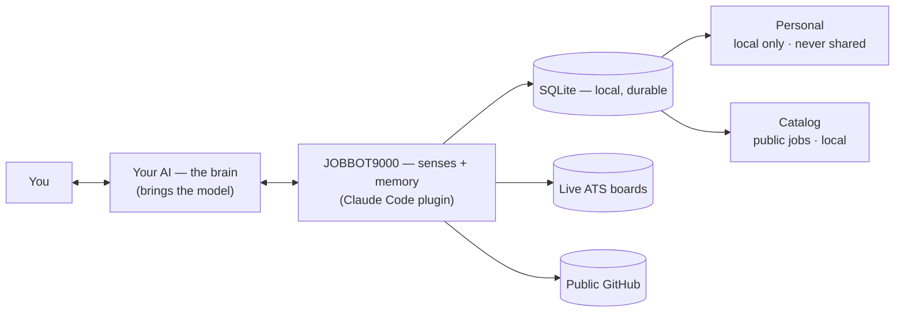
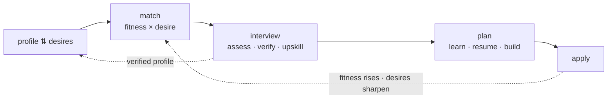

# jobbot9000

A local, market-aware **job-search readiness loop** for your AI agent — packaged as a **Claude Code plugin**. One install bundles an MCP server (which reads the real job market and holds your journey) and the skills that drive it. Your agent is the brain; this is its senses and memory. Nothing is hosted, no keys leave your machine, and the whole journey persists locally across sessions that may span months.



## The loop — the product

jobbot is a **positive feedback loop** that takes a candidate from "looking" to "hired and better":



- **profile ⇅ desires** — what the user *can* do and what they *want* keep re-informing each other.
- **match** — roles scored on fitness **and** desire; the tension between them is the signal.
- **interview** — the engine. It **assesses** (the primary evidence for candidates with no public portfolio — depth is shown by explaining, not linking), **verifies** (separates a builder from a confident résumé), and **upskills** (shows what a great answer looks like). Repeatable as practice.
- **plan** — gaps become a tracked plan: things to **learn**, **resume** changes, and portfolio **projects to build**, grounded in real market demand.
- **apply** — a packet + a tailored cover letter, gated on honesty (write to the verified floor; never over-claim).
- **re-match** — closing gaps raises fitness and re-opens a higher band of roles. The loop turns.

## How it works

- **The agent is the brain; the server is senses + memory.** It reads the live market straight from company ATS boards and public GitHub, holds the journey in an embedded SQLite DB, and coaches honestly against real demand. It does not think — your agent does.
- **You bring the model; the server holds none** — no keys, tokens, or login. Single-tenant, local. That's why it's an MCP server, not a hosted app.
- **Durable & resumable.** State and the full history live in SQLite under the plugin's persistent data dir (survives sessions *and* plugin updates). An append-only **journal** records every meaningful step (assessments, interviews, plan changes, applications…), so a months-long search never loses progress and the whole timeline is reconstructable. **Every session starts with `orient`, which rehydrates state and surfaces open threads to resume.**

Two rules hold everywhere:

- **The agent never writes the database.** Only `src/db.ts` writes; tools call its accessors.
- **Judgment** (a competency level, a job's grade, a role fit, an upskilling plan, a cover letter) enters only through a named **structured-write tool** governed by a **grading mode** (a rubric + schema, in `modes/*.json`). The tool validates the agent's output and surfaces the mode's closed vocabularies as `z.enum`s.

**Honesty is architected in.** A resume/GitHub is treated as a *claim*, weighted by how *verified* it is (`corroborated` > `demonstrated` > `self_published` > `claimed`). Absence of a portfolio lowers **confidence**, never the level. `high` confidence requires an interview. Resume-building and upskilling raise *real* fitness — never fabricate experience.

**Two data planes:** **Personal** (profile, desires, resume, competency profile, interviews, plan, applications, journal) is **always local, never shared.** **Catalog** (companies + their live jobs — public market data) is local. Nothing leaves the machine.

## The surface — 15 tools

**Three doors:**

- **`orient(detail?)`** — start every session here. Where the user is in the loop, the next best action (`recommended_skill` — the router, priority-ordered over the loop's edges so every state has a way forward), **open threads to resume**, and the recent journal. `detail`: `recommend` (default), `dashboard` (the competency profile, market gap, plan, notes).
- **`look(at, …)`** — the one read door; never fetches, never writes. `at`: `jobs` (`market`/`relevant`/`worklist`), `companies`, `resume`, `portfolio`, `profile`, `competency`, `interview`, `plan`, `packet`, `applications`, `history`.
- **`gather(step, …)`** — the one fetch door. `step`: `find_companies` (discover → resolve ATS slugs; free by default, TheirStack opt-in), `fetch_jobs` (pull live ATS boards), `ingest_portfolio` (public GitHub repos + verification signals).

**Twelve writes** — five mechanical, seven judgment (each governed by a mode):

| Tool | Plane | Mode |
|---|---|---|
| `capture_profile` | personal | — (identity + **desires**) |
| `set_resume` | personal | `resume_revision` when a rationale is given (a coached revision, journaled); else a wholesale user edit |
| `add_portfolio_project` | personal | — (a described/private project; added **unverified**) |
| `record_application` | personal | — (reported status) |
| `update_plan_progress` | personal | — (suggested → in_progress → done) |
| `assess_competency` | personal | `competency_profile` (per-dimension; skeptical; absence ≠ low level) |
| `record_interview` | personal | `interview` (competency or role-fit) |
| `grade_job` | catalog | `job_intrinsic` |
| `assess_role_fit` | personal | `role_fit` (per-dimension + desire alignment) |
| `grade_portfolio_project` | personal | `portfolio_relevance` |
| `recommend_upskilling` | personal | `upskilling_plan` (learn/resume/build, market-grounded) |
| `record_cover_letter` | personal | `cover_letter` (gated on verified confidence) |

The competency profile is **multi-dimensional** — `technical_depth`, `system_design`, `communication`, `ownership` — each with a level, confidence, and provenance-tagged evidence; the overall band is derived.

## The skills

Five playbooks, invoked automatically by their `description` (and as `/jobbot9000:<name>`): **coach** (onboard + assess), **verify** (the competency interview), **upskill** (plan + resume + projects), **job-search** (discover + grade + match), **application** (rehearse + apply + track). Each opens with `orient`, so any session resumes the loop.

Company discovery and live job fetching are **keyless and free by default**; TheirStack is an **opt-in paid accelerator** (`THEIRSTACK_API_KEY`, count-first, credit-ceiling-gated). Greenhouse / Ashby / Lever are verified against live boards; Workable is best-effort.

## Install (Claude Code)

Claude Code installs plugins from a **marketplace**. Two ways:

**Quick / development — `--plugin-dir`** (session-scoped):

```
claude --plugin-dir /path/to/jobbot9000
```

**Persistent — via the bundled local marketplace:**

```
/plugin marketplace add /path/to/jobbot9000
/plugin install jobbot9000@jobbot9000
```

Verify with `/mcp` — you should see `plugin:jobbot9000:jobbot · connected · 15 tools`.

On the first session after install, a bootstrap hook (`hooks/hooks.json` → `scripts/bootstrap.mjs`) installs the server's dependencies into the persistent data dir and builds it; it no-ops afterward. First-run setup compiles a native dependency, so it takes a moment.

State and the local catalog live in an embedded SQLite database under `${CLAUDE_PLUGIN_DATA}/state/` (resolves to `~/.claude/plugins/data/<plugin-id>/state/`), which survives across sessions **and** plugin updates. (Fallback: `~/.jobbot/state`.) Uninstalling deletes the data dir unless you pass `--keep-data`.

## Develop

```
npm install
npm run build      # compile the MCP server to dist/
npm run dev        # run the server over stdio (tsx)
npm test           # offline test suite (tsx against src/, mocked HTTP — no network/key)
```

The server reads `STATE_DIR` (the plugin sets it to `${CLAUDE_PLUGIN_DATA}/state`) and opens `jobbot.db` there; unset, it falls back to `~/.jobbot/state`.

**Heads-up when running Claude Code *inside* this repo:** the root `.mcp.json` is auto-discovered as a *project* server but `${CLAUDE_PLUGIN_ROOT}` only expands in *plugin* context, so that project-scoped copy fails harmlessly (`MCP error -32000`). Run `claude --plugin-dir` from **outside** the repo, or disable the project `jobbot` server in `/mcp`. The real plugin shows as `plugin:jobbot9000:jobbot`.

**Discovery env (all optional — discovery is free without any of it):** `find_companies` defaults to the free curated roster + on-demand path; ATS resolution is keyless. `JOBBOT_SEEDS_FILE` points the roster at your own file. Only the opt-in TheirStack accelerator reads `THEIRSTACK_API_KEY` + `THEIRSTACK_MAX_CREDITS_PER_RUN` (default `150`). `ingest_portfolio` reads public GitHub keylessly; `GITHUB_TOKEN`, if set, only raises the rate limit (and makes authorship verification more reliable).

## Layout

```
.claude-plugin/plugin.json   plugin manifest
.mcp.json                    bundled MCP server config
src/
  index.ts                   stdio entry; registers the tools
  db.ts                      SQLite schema + accessors — the only code that writes the DB (incl. the journal + history)
  state.ts                   the loop state machine (state derived from what data exists)
  tools.ts                   the 16-tool surface
  providers.ts               lead-gen seam — curated (free, default) + TheirStack (opt-in)
  ats.ts                     keyless ATS — slug resolution + board fetch/normalize (Ashby/Greenhouse/Lever/Workable)
  github.ts                  keyless GitHub sense — public repos + verification signals (authorship/traction/badges)
seeds/                       curated company roster (free default for find_companies); ships empty
skills/                      bundled skills: coach / verify / upskill / job-search / application
modes/                       grading modes (rubric + schema) for the judgment writes
hooks/, scripts/             SessionStart bootstrap (install + build on first run)
```

## Extending

Any extension must respect the invariants — **the agent never writes the DB** (only `db.ts`), **judgment enters only through a mode-governed named write**, **tools are safe in any call order** (degrade with an honest note, never throw), and **no union input schemas**.

- **A new read view** → add an `at` case to **`look`**.
- **A new judgment** → register a named structured-write tool + a grading mode (`modes/<name>.json` with `rubric`, `output_schema`, and `constraints` carrying the closed `*_must_be_one_of` vocabularies); the tool builds its `z.enum`s from the mode.
- **A new external fetch** → add a `step` case to **`gather`**, persist via a `db.ts` helper, return the findings.
- **A new skill** → drop `skills/<name>/SKILL.md` with `name` + `description` frontmatter; it auto-registers as `/<name>`.
- **A new journey dimension** → extend the `Dimension` union in `src/state.ts` and add its predicate in `readJourneyState`.
- **Durability** → any new stateful step persists in the DB and, if it's a meaningful event, appends to the `events` journal (`db.logEvent`), so a fresh session resumes it.
